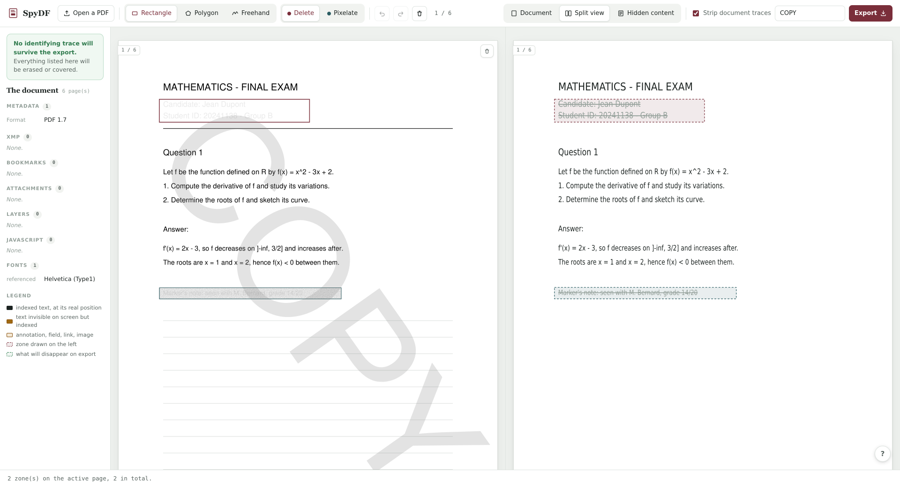

# SpyDF

Local webapp to redact PDF exams: draw zones over regions to remove (names,
student IDs, ...), and export a PDF where the underlying text, image and
vector objects are actually deleted — not just covered by a drawn box.
Everything runs locally and in memory; nothing is uploaded anywhere.



## Install

SpyDF is run with [uv](https://docs.astral.sh/uv/), which handles the Python
version and the dependencies for you. If you do not have it:

```bash
curl -LsSf https://astral.sh/uv/install.sh | sh     # macOS, Linux
```

```powershell
powershell -c "irm https://astral.sh/uv/install.ps1 | iex"   # Windows
```

It is also in most package managers — `brew install uv`, `pipx install uv`,
`winget install astral-sh.uv`. Restart your shell afterwards so `uv` is on your
`PATH`, then:

```bash
git clone <this repo> && cd spydf
uv sync
```

`uv sync` creates `.venv` and installs everything pinned in `uv.lock`. No
`pip install`, no manual virtualenv, no system Python to match.

## Usage

```bash
uv run main.py
```

This opens `http://127.0.0.1:8765` in your browser. Drop a PDF in — or click
the drop zone to pick one — mark the zones, then export.

### Zones

Three shapes: **rectangle**, **polygon** (click the vertices, double-click to
close) and **freehand**. Drag a zone to move it, its handles to resize it.

What disappears follows the **outline you drew**, whatever its shape. PyMuPDF
can only redact rectangles, so a polygon or freehand zone is cut into thin
horizontal strips that hug the outline, and each strip is redacted. Strips
overshoot the outline by at most one strip height (measured: 1.25 pt, under
half a millimetre) — over-deleting a little is acceptable, leaving content
alive inside the shape is not. That matters most on a scan, where the page is
a single image: redacting the bounding box would destroy its pixels and turn
the whole box white under a cover that followed the outline.

Each zone has a mode, switched from its right-click menu:

- **Delete** — the content is removed and the area covered in white.
- **Pixelate** — the area is replaced by a genuine downsample of itself,
  an unreadable mosaic; the source objects are removed just the same.

### Pages

The trash button on a page marks it for deletion; the page is dropped from the
exported document entirely.

### Beyond the visible page

"Strip document traces" (on by default) also clears what redaction
leaves untouched because it does not live in the page content: metadata, XMP,
bookmarks (often the student's name), attachments, JavaScript, links, form
responses and optional-content layer names. Annotations and form fields
intersecting a zone are deleted explicitly.

### The inspector pane

Opening a PDF in a reader only shows you a picture of it. The right-hand pane
redraws each page at the exact size of the one on the left, empty except for
what the file carries without showing it — each item at the position it really
occupies, so the two panes read one on top of the other. Because the pages
match, scrolling is synchronised both ways: whichever pane you scroll takes
the lead and the other follows to the same page at the same height.

What has no position on any page (metadata, bookmarks, scripts…) lives in the
column on the far left. Between them, the pane accounts for:

- the **indexed text layer** — what is selectable, copyable and searchable,
  including any **invisible text** (an OCR layer under a scan, or text hidden
  on purpose), which is highlighted because it leaks while showing nothing;
- **metadata** and **XMP** — author, title, keywords, and the scanner or
  application that produced the file;
- **bookmarks**, often literally "Copie de <student name>";
- **annotations** with their author, **form fields** with their values,
  **attachments**, **layers**, **links**, **fonts** and any **JavaScript**.

Every item is marked *erased* or *kept* according to the zones you have
drawn and the scrubbing checkbox, with a count of what would still leak, so
you can see the result before exporting. Your zones are echoed onto the ghost
pages, which is what makes a near-miss visible: text sitting just outside an
outline stays black and counted. The pane is read-only.

Three views from the toolbar: document only, both (default), hidden content
only.

### Verification

After writing the file, the exporter re-opens **the exported bytes** and looks
for text, annotations or form fields still inside a redacted zone. A word
counts as a survivor once a redacted strip covers a real part of it, not when
it merely grazes the outline. Any survivor is reported in the status bar, so a
failed redaction is visible rather than silent.

### Keyboard

`Ctrl+Z` / `Ctrl+Y` undo and redo. `Tab` moves between zones, `Enter` opens
the selected zone's menu, `Delete` removes it, `Esc` cancels.

### Watermark

The field next to **Export** stamps a line of text diagonally across every
exported page. A preview appears on the pages as you type, so you can see where
it lands. It is applied *after* the leak check runs, so the watermark's own text
can never be mistaken for — or mask — a leak.

## Development

```bash
uv sync          # installs dev dependencies too
uv run main.py
uv run pytest    # regression tests for the redaction path
uv run ruff check .    # lint
uv run ruff format .   # format
```

The tests build a PDF carrying one of each class of identifying trace, export
it through the real routes, and assert none survives in the raw bytes or in
any decompressed stream of the result.

## Project layout

- `main.py` — entry point
- `src/app.py` — FastAPI routes (open/render/inspect/export/download)
- `src/config.py` — every tunable, read from the environment and `.env`
- `src/logs.py` — the audit log (connection, import, export)
- `src/probe.py` — read-only extraction of the document's invisible payload
- `src/server.py` — server bootstrap (opens browser, runs uvicorn)
- `src/templates/index.html` — page shell
- `src/static/app.js` — pages, zones, export
- `src/static/inspector.js` — the inspector pane
- `tests/` — regression tests

## Running it

### Locally

```bash
uv sync
uv run main.py
```

Binds `127.0.0.1:8765` and opens your browser.

### Configuration

Every setting lives in `src/config.py` with a default, so SpyDF runs with no
configuration at all. To change one, set an environment variable or drop a
`.env` file next to `pyproject.toml`:

```bash
cp .env.example .env
```

`.env.example` lists every variable at its default value, so an untouched copy
changes nothing. Real environment variables win over the file, which keeps a
container's `environment:` block in charge.

**Server**

| Variable | Default | What it does |
| --- | --- | --- |
| `HOST` | `127.0.0.1` | interface to bind; the Docker image sets `0.0.0.0` |
| `PORT` | `8765` | port to bind |

**Sessions** — documents live in memory only, never on disk.

| Variable | Default | What it does |
| --- | --- | --- |
| `SPYDF_MAX_UPLOAD_BYTES` | `209715200` | upload cap, 200 MB |
| `SPYDF_SESSION_TTL` | `7200` | seconds a forgotten document may stay in RAM |
| `SPYDF_MAX_SESSIONS` | `32` | how many documents are held at once |

**Page rendering** — a PDF is vector art, so a resolution has to be chosen; the
app renders what the screen actually shows.

| Variable | Default | What it does |
| --- | --- | --- |
| `SPYDF_RENDER_ZOOM` | `4.0` | zoom used when the client asks for no width |
| `SPYDF_MIN_ZOOM` | `1.5` | lower bound when it does |
| `SPYDF_MAX_ZOOM` | `8.0` | upper bound; a memory guard rail, 8x on A4 is ~128 Mpx |

**Redaction**

| Variable | Default | What it does |
| --- | --- | --- |
| `SPYDF_MOSAIC_BLOCKS` | `14` | width of a pixelated zone in "big pixels"; lower is coarser |
| `SPYDF_STRIP_HEIGHT` | `2.0` | height of one redaction strip, in PDF points |
| `SPYDF_MAX_STRIPS` | `200` | cap on the strips a single zone may produce |
| `SPYDF_MASK_MAX_PX` | `240` | resolution of the mask clipping a mosaic to its outline |
| `SPYDF_LEAK_COVERAGE` | `0.15` | share of a word inside a zone above which it is reported as a leak |
| `SPYDF_RECOMPRESS_QUALITY` | `80` | JPEG quality for the images redaction rewrote losslessly; `0` keeps them lossless, and a scan then exports several times heavier than it came in |

**Watermark**

| Variable | Default | What it does |
| --- | --- | --- |
| `SPYDF_WATERMARK_MAX_LEN` | `80` | longest accepted watermark |
| `SPYDF_WATERMARK_MIN_SIZE` | `8` | smallest font size, in points |
| `SPYDF_WATERMARK_DIAGONAL_RATIO` | `0.78` | share of the page diagonal the text aims to span — an aim only, since it is also clamped to fit the page |
| `SPYDF_WATERMARK_FONT` | `helv` | must be a base-14 font, resolved without a font file |

**Logging** — connection, import and export always go to stderr.

| Variable | Default | What it does |
| --- | --- | --- |
| `SPYDF_LOG_LEVEL` | `INFO` | verbosity |
| `SPYDF_LOG_FILE` | *(unset)* | also write a rotating log file |
| `SPYDF_LOG_FILE_MAX_BYTES` | `1048576` | size at which that file rotates |
| `SPYDF_LOG_FILE_BACKUPS` | `3` | how many rotations are kept |
| `SPYDF_LOG_FILENAMES` | `0` | opt in to logging uploaded file names |
| `SPYDF_SID_LOG_LEN` | `8` | characters of a session id that may reach a log line |
| `SPYDF_UA_MAX_LEN` | `120` | user-agent is client-supplied, so it is bounded |

The log is written with the same care as the export. An uploaded file name is
identifying — real ones look like `copie_jean_dupont.pdf` — so it is recorded
only under `SPYDF_LOG_FILENAMES=1`. Leak text and watermark text are never
logged at any setting: only the leak count, and whether a watermark was used.
A whole session id grants access to `/api/download/{key}`, so only its first
few characters are logged.

### Locally, in Docker

```bash
docker build -t spydf .
docker run --rm -p 8765:8765 spydf
```

The image sets `HOST=0.0.0.0` so the app is reachable from outside the
container; without it uvicorn would bind to the container's own loopback and
the published port would answer nothing.

### Deployed (Dokploy)

`docker-compose.yml` is the deploy descriptor, built from the same Dockerfile.
Point a Dokploy **Compose** application at this repo; it runs

```bash
docker compose -f ./docker-compose.yml up -d --build
```

The service publishes `8765:8765`, so the app answers on the host directly at
`http://<server>:8765`. It also joins `dokploy-network`, which lets you attach
a domain from Dokploy's **Domains** tab (service `spydf`, port `8765`) and go
through Traefik instead. That network is declared `external` because Dokploy's
installer creates it — on a machine without it `docker compose up` fails, so
locally use the plain `docker run` above.

The app has **no authentication and no persistence** (documents live in an
in-memory dict, keyed by session id). Anyone who can reach the host on 8765
can use it and upload to it, and that port bypasses Traefik — so any auth
middleware you add to the router does not cover it. Firewall the port, or
switch the mapping to `127.0.0.1:8765:8765` and reach it over an SSH tunnel,
if the server is on a public network.
