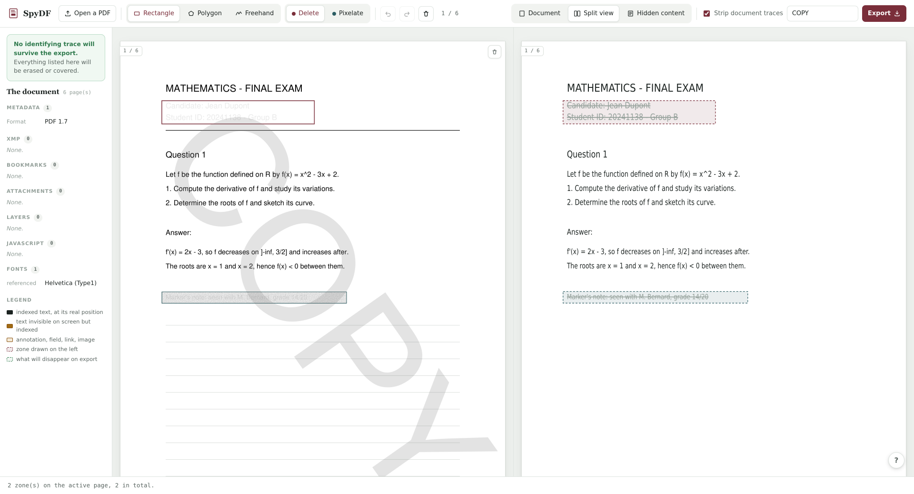

# SpyDF

Local webapp to redact PDF exams: draw zones over regions to remove (names,
student IDs, ...), and export a PDF where the underlying text, image and
vector objects are actually deleted — not just covered by a drawn box.
Everything runs locally and in memory; nothing is uploaded anywhere.



## Install

SpyDF is run with [uv](https://docs.astral.sh/uv/), which handles the Python
version and the dependencies for you. If you do not have it:

```bash
curl -LsSf https://astral.sh/uv/install.sh | sh     # macOS, Linux
```

```powershell
powershell -c "irm https://astral.sh/uv/install.ps1 | iex"   # Windows
```

It is also in most package managers — `brew install uv`, `pipx install uv`,
`winget install astral-sh.uv`. Restart your shell afterwards so `uv` is on your
`PATH`, then:

```bash
git clone <this repo> && cd spydf
uv sync
```

`uv sync` creates `.venv` and installs everything pinned in `uv.lock`. No
`pip install`, no manual virtualenv, no system Python to match.

## Usage

```bash
uv run main.py
```

This opens `http://127.0.0.1:8765` in your browser. Drop a PDF in — or click
the drop zone to pick one — mark the zones, then export.

### Zones

Three shapes: **rectangle**, **polygon** (click the vertices, double-click to
close) and **freehand**. Drag a zone to move it, its handles to resize it.

What disappears follows the **outline you drew**, whatever its shape. PyMuPDF
can only redact rectangles, so a polygon or freehand zone is cut into thin
horizontal strips that hug the outline, and each strip is redacted. Strips
overshoot the outline by at most one strip height (measured: 1.25 pt, under
half a millimetre) — over-deleting a little is acceptable, leaving content
alive inside the shape is not. That matters most on a scan, where the page is
a single image: redacting the bounding box would destroy its pixels and turn
the whole box white under a cover that followed the outline.

Each zone has a mode, switched from its right-click menu:

- **Delete** — the content is removed and the area covered in white.
- **Pixelate** — the area is replaced by a genuine downsample of itself,
  an unreadable mosaic; the source objects are removed just the same.

The cover of a **delete** zone is painted in the colour of the paper it was
drawn on: the average of the pixels its outline passes over — the outline, not
the inside, which is the content about to go. On a coloured or greyish scan a
white patch is itself a mark, it says where something was; matching the paper
leaves nothing to notice. The zone's right-click menu holds that colour as
three **RGB** numbers and a **pipette** that takes a colour from a click
anywhere on the page. The pipette reads the rendered page, not the screen, so
clicking on a zone samples the paper underneath rather than the cover on top.
The redaction strips are filled in the same colour, so no white sliver shows
around a non-rectangular zone.

The closing double-click of the polygon is taken before the browser gets it: it
would otherwise start a word selection on the nearest text — which a
translation or dictionary extension then picks up on a word you never meant to
select.

### Reloading the page

Reloading — `F5`, `Ctrl+F5`, a misplaced shortcut — used to throw away
everything and ask for the file again, although the document itself had never
left the server: the page simply held the only copy of the session id, of the
zones and of the page geometry.

It now picks them back up. The zones, the deleted pages, the watermark and the
scrubbing checkbox are kept in the tab's own storage, and the document is asked
back from the server by its session id. If that session is gone — expired after
`SPYDF_SESSION_TTL`, or the server was restarted — the marking goes with it and
you land back on the drop zone, rather than drawing zones over nothing.

There is nothing to click and nothing saved to disk: it lives in
`sessionStorage`, which survives a reload and goes when the tab closes.

### Pages

The trash button on a page marks it for deletion; the page is dropped from the
exported document entirely.

### Zoom

`Ctrl` with the wheel, `Ctrl` and `+` / `−` / `0`, or the buttons in the
toolbar, from 25% to 500%. Zooming under the cursor keeps the point under it
still, and both views zoom together: the zoom is a single factor the two panes
size their pages from, so a page on the right can never end up a different size
from the one on the left.

Once a page is wider than its pane, drag it with the **middle button** or hold
**Space** and drag with the left one; the arrows, `Page Up`/`Page Down`,
`Home` and `End` move around too. Panning one pane scrolls the other to the
same place, horizontally included.

Pages are re-rendered server-side at the new size once the zoom settles, so
zooming in gives you more detail rather than a bigger blur.

### Beyond the visible page

"Strip document traces" (on by default) also clears what redaction
leaves untouched because it does not live in the page content: metadata, XMP,
bookmarks (often the student's name), attachments, JavaScript, links, form
responses, optional-content layer names, and the text a tagged PDF carries
outside its pages (`/Alt`, `/ActualText`, `/E`). Annotations and form fields
intersecting a zone are deleted explicitly.

It also empties the images themselves. A copy photographed with a phone, or
scanned by a device that fills its fields, arrives with **Exif** inside the
image stream: make, model, body serial number, the date, sometimes a GPS fix —
and a **thumbnail**, which is a complete copy of the picture in miniature. That
last one matters: redaction blanks pixels in the main image and does not touch
the thumbnail, so an otherwise perfect export can ship a small picture of the
page *before* anything was drawn over it. Redaction only rewrites the images a
zone touches, and nothing else in a PDF toolchain looks inside an image stream,
so this is the only step that reaches any of it.

The removal is a cut between the JPEG's marker segments: the pixels are never
decoded and re-encoded, so the image loses no quality. What describes how the
pixels are to be read — the JFIF density, the ICC colour profile, Adobe's colour
transform — is kept, since dropping it would change how the image looks rather
than who it identifies.

### The inspector pane

Opening a PDF in a reader only shows you a picture of it. The right-hand pane
redraws each page at the exact size of the one on the left, empty except for
what the file carries without showing it — each item at the position it really
occupies, so the two panes read one on top of the other. Because the pages
match, scrolling is synchronised both ways: whichever pane you scroll takes
the lead and the other follows to the same page at the same height.

What has no position on any page (metadata, bookmarks, scripts…) lives in the
column on the far left. Between them, the pane accounts for:

- the **indexed text layer** — what is selectable, copyable and searchable,
  including any **invisible text** (an OCR layer under a scan, or text hidden
  on purpose), which is highlighted because it leaks while showing nothing;
- **metadata** and **XMP** — author, title, keywords, and the scanner or
  application that produced the file;
- **bookmarks**, often literally "Copie de <student name>";
- **opaque covers** — a white box painted over a scan hides pixels without
  removing one of them. Every renderer paints the box, so the area looks blank
  here too and nothing invites you to draw a zone there, while the image still
  carries the original: any OCR, "extract images" or object-delete gets it
  back. A cover is found by paint order — opaque paint with something already
  painted under it — so a *picture* used as a patch counts, which is what a
  phone's markup tool produces, and paint over blank paper does not. The pane
  outlines those areas in red, **shows you what each one hides**, taken from
  the image itself, and counts them as *still there* until a zone covers one —
  a zone does destroy the pixels underneath. "Redact all" hands you one zone
  per cover, on every page;
- **what the images say** — a picture of a page holds text that no text layer
  knows about, and readers do read it. Chrome has OCR'd scanned PDFs since
  version 126, and it does *not* read the page it shows you: it reads each
  image object on its own, then lays the recognised text back over it so it can
  be selected. A patch dropped on a scan is a separate object, so the OCR never
  sees it — which is why a name under a white box can still be selected and
  copied in the browser. This pane reads the images the same way and marks
  every fragment that sits under a cover: hidden from you, readable by the next
  person who opens the file. It costs seconds a page, so it is a button rather
  than something you wait for;
- **image metadata** — the Exif, XMP, IPTC and comments an image carries in its
  own stream, one row per field: camera, serial number, date, GPS, thumbnail.
  It is listed in the column rather than on the page because that is where it
  lives: no zone reaches into an image stream, only the scrubbing does, and the
  pane marks these on the checkbox alone rather than on the zones you drew;
- **text carried outside the pages** — a tagged PDF describes a figure in
  `/Alt`, stores the characters behind a glyph run in `/ActualText` and an
  abbreviation's expansion in `/E`. Readers show and copy it, indexers index
  it, and no zone can reach it: it is not page content. On a scan it is
  regularly the only text a page has, so a page that reads as "image only"
  everywhere else is not necessarily silent;
- **annotations** with their author, **form fields** with their values,
  **attachments**, **layers**, **links**, **fonts** and any **JavaScript**.

Every item is marked *erased* or *kept* according to the zones you have
drawn and the scrubbing checkbox, with a count of what would still leak, so
you can see the result before exporting. Your zones are echoed onto the ghost
pages, which is what makes a near-miss visible: text sitting just outside an
outline stays black and counted. The pane is read-only.

Three views from the toolbar: document only, both (default), hidden content
only.

### Verification

After writing the file, the exporter re-opens **the exported bytes** and looks
for text, annotations or form fields still inside a redacted zone. A word
counts as a survivor once a redacted strip covers a real part of it, not when
it merely grazes the outline. Any survivor is reported in the status bar, so a
failed redaction is visible rather than silent.

The text layer is not the whole check. A scan has none, so looking only for
words would pass every image-only document without having verified anything —
and that is the one kind of document where covering instead of deleting is the
norm. So the zones are also read back the way a reader would read them, image
by image. A fragment must lie almost entirely inside a zone to count, because
recognition returns whole lines: a heading the zone's edge merely clips is not
a leak, or every export would cry wolf.

### Keyboard

`Ctrl+Z` / `Ctrl+Y` undo and redo. `Tab` moves between zones, `Enter` opens
the selected zone's menu, `Delete` removes it, `Esc` cancels. `Ctrl` with
`+` / `−` / `0` zooms; arrows, `Page Up`/`Page Down`, `Home`/`End` and `Space`
held with a drag move around a zoomed page.

### Watermark

The field next to **Export** stamps a line of text diagonally across every
exported page. A preview appears on the pages as you type, so you can see where
it lands. It is applied *after* the leak check runs, so the watermark's own text
can never be mistaken for — or mask — a leak.

### Signing in

With no password configured — the default, and what a run on `127.0.0.1`
wants — SpyDF opens straight onto the workspace. Set `SPYDF_AUTH_PASSWORD` and
it asks for it first, on a page of its own rather than through the browser's
Basic-auth dialog: the app's own card, the error spelled out in place, the user
name kept after a wrong password, and a **sign out** button at the end of the
header once you are in.

A login lasts `SPYDF_AUTH_TTL` seconds (12 h by default) and rides in one
cookie, `HttpOnly` and `SameSite=Lax`, `Secure` as soon as the request arrives
over HTTPS. Nothing else about you is stored, on the server or in the browser.
If the login expires while a tab is still open, the next call it makes hands
you back to the login page rather than failing in the status bar — the marking
in the tab survives, and so does the document, as long as its own session has
not expired.

Failed attempts are counted per address: `SPYDF_AUTH_MAX_TRIES` of them and
that address waits `SPYDF_AUTH_LOCKOUT` seconds before it may try again. The
log records the address and the outcome, never the submitted name or password.

## Development

```bash
uv sync          # installs dev dependencies too
uv run main.py
uv run pytest    # regression tests for the redaction path
uv run ruff check .    # lint
uv run ruff format .   # format
```

The tests build a PDF carrying one of each class of identifying trace, export
it through the real routes, and assert none survives in the raw bytes or in
any decompressed stream of the result. One of them builds an Exif block by hand
— camera, serial, GPS, thumbnail — and checks both that the export removes it
and that the image still decodes, pixel for pixel, afterwards.

## Project layout

- `main.py` — entry point
- `src/app.py` — FastAPI routes (open/render/inspect/export/download)
- `src/config.py` — every tunable, read from the environment and `.env`
- `src/auth.py` — the login: credentials, signed cookie, lockout
- `src/logs.py` — the audit log (connection, import, export)
- `src/probe.py` — read-only extraction of the document's invisible payload
- `src/imagemeta.py` — the metadata carried inside an image, read and removed
- `src/ocr.py` — the images read one at a time, the way Chrome reads them
- `src/server.py` — server bootstrap (opens browser, runs uvicorn)
- `src/templates/index.html` — page shell
- `src/static/app.js` — pages, zones, export
- `src/static/inspector.js` — the inspector pane
- `tests/` — regression tests

## Running it

### Locally

```bash
uv sync
uv run main.py
```

Binds `127.0.0.1:8765` and opens your browser.

### Configuration

Every setting lives in `src/config.py` with a default, so SpyDF runs with no
configuration at all. To change one, set an environment variable or drop a
`.env` file next to `pyproject.toml`:

```bash
cp .env.example .env
```

`.env.example` lists every variable at its default value, so an untouched copy
changes nothing. Real environment variables win over the file, which keeps a
container's `environment:` block in charge.

**Server**

| Variable | Default | What it does |
| --- | --- | --- |
| `HOST` | `127.0.0.1` | interface to bind; the Docker image sets `0.0.0.0` |
| `PORT` | `8765` | port to bind |

**Login** — off entirely while `SPYDF_AUTH_PASSWORD` is empty.

| Variable | Default | What it does |
| --- | --- | --- |
| `SPYDF_AUTH_USER` | `admin` | the one account name the login page accepts |
| `SPYDF_AUTH_PASSWORD` | *(unset)* | in clear, or as `sha256:<hex>`; empty means no login page at all |
| `SPYDF_AUTH_SECRET` | *(unset)* | signs the login cookie; unset draws a fresh one per process, so a restart signs everybody out |
| `SPYDF_AUTH_TTL` | `43200` | seconds one login stays valid |
| `SPYDF_AUTH_MAX_TRIES` | `10` | failures from one address before it has to wait |
| `SPYDF_AUTH_LOCKOUT` | `300` | length of that wait, and of the window the failures are counted in |

To keep the password out of the environment in clear:

```bash
python -c "import hashlib,getpass;print('sha256:'+hashlib.sha256(getpass.getpass().encode()).hexdigest())"
```

Changing the user name or the password invalidates every cookie already issued,
since the cookie key is derived from both.

The app takes the password exactly as it arrives — spaces at either end, accents,
anything — but a `.env` file read by Docker Compose does not, and that is where an
awkward password quietly turns into a different one:

| In the `.env` | What the container receives |
| --- | --- |
| `PW=abc$def` | `abc` — `$def` is read as a variable and substituted empty |
| `PW=abc$$def` | `abc` — escaping does not survive the second pass either |
| `PW=abc #def` | `abc` — a space then `#` starts a comment |
| `PW=abc   ` | `abc` — trailing spaces go |
| `PW="a\tb"` | `a<TAB>b` — quotes are unwrapped and escapes expanded |

`@ ! % & * ( ) { } [ ] ' :` and accents all pass through untouched; `$` is the one
character with no working escape. If your password contains one, configure it as
`sha256:<hex>` instead — the digest is plain hex, so nothing in the chain can
mangle it, and you still type the real password on the login page.

To see what actually reached the app: `docker exec <container> printenv SPYDF_AUTH_PASSWORD`.
The startup log line also says `login=on` or `login=off`, which tells you whether
the variable arrived at all.

**Sessions** — documents live in memory only, never on disk.

| Variable | Default | What it does |
| --- | --- | --- |
| `SPYDF_MAX_UPLOAD_BYTES` | `209715200` | upload cap, 200 MB |
| `SPYDF_SESSION_TTL` | `7200` | seconds a forgotten document may stay in RAM |
| `SPYDF_MAX_SESSIONS` | `32` | how many documents are held at once |

**Page rendering** — a PDF is vector art, so a resolution has to be chosen; the
app renders what the screen actually shows.

| Variable | Default | What it does |
| --- | --- | --- |
| `SPYDF_RENDER_ZOOM` | `4.0` | zoom used when the client asks for no width |
| `SPYDF_MIN_ZOOM` | `1.5` | lower bound when it does |
| `SPYDF_MAX_ZOOM` | `8.0` | upper bound; a memory guard rail, 8x on A4 is ~128 Mpx |

**Redaction**

| Variable | Default | What it does |
| --- | --- | --- |
| `SPYDF_MOSAIC_BLOCKS` | `14` | width of a pixelated zone in "big pixels"; lower is coarser |
| `SPYDF_STRIP_HEIGHT` | `2.0` | height of one redaction strip, in PDF points |
| `SPYDF_MAX_STRIPS` | `200` | cap on the strips a single zone may produce |
| `SPYDF_MASK_MAX_PX` | `240` | resolution of the mask clipping a mosaic to its outline |
| `SPYDF_LEAK_COVERAGE` | `0.15` | share of a word inside a zone above which it is reported as a leak |
| `SPYDF_RECOMPRESS_QUALITY` | `80` | JPEG quality for the images redaction rewrote losslessly; `0` keeps them lossless, and a scan then exports several times heavier than it came in |

**Watermark**

| Variable | Default | What it does |
| --- | --- | --- |
| `SPYDF_WATERMARK_MAX_LEN` | `80` | longest accepted watermark |
| `SPYDF_WATERMARK_MIN_SIZE` | `8` | smallest font size, in points |
| `SPYDF_WATERMARK_DIAGONAL_RATIO` | `0.78` | share of the page diagonal the text aims to span — an aim only, since it is also clamped to fit the page |
| `SPYDF_WATERMARK_FONT` | `helv` | must be a base-14 font, resolved without a font file |

**Logging** — connection, import and export always go to stderr.

| Variable | Default | What it does |
| --- | --- | --- |
| `SPYDF_LOG_LEVEL` | `INFO` | verbosity |
| `SPYDF_LOG_FILE` | *(unset)* | also write a rotating log file |
| `SPYDF_LOG_FILE_MAX_BYTES` | `1048576` | size at which that file rotates |
| `SPYDF_LOG_FILE_BACKUPS` | `3` | how many rotations are kept |
| `SPYDF_LOG_FILENAMES` | `0` | opt in to logging uploaded file names |
| `SPYDF_SID_LOG_LEN` | `8` | characters of a session id that may reach a log line |
| `SPYDF_UA_MAX_LEN` | `120` | user-agent is client-supplied, so it is bounded |

The log is written with the same care as the export. An uploaded file name is
identifying — real ones look like `copie_jean_dupont.pdf` — so it is recorded
only under `SPYDF_LOG_FILENAMES=1`. Leak text and watermark text are never
logged at any setting: only the leak count, and whether a watermark was used.
A whole session id grants access to `/api/download/{key}`, so only its first
few characters are logged.

### Locally, in Docker

```bash
docker build -t spydf .
docker run --rm -p 8765:8765 spydf
```

The image sets `HOST=0.0.0.0` so the app is reachable from outside the
container; without it uvicorn would bind to the container's own loopback and
the published port would answer nothing.

### Deployed (Dokploy)

`docker-compose.yml` is the deploy descriptor, built from the same Dockerfile.
Point a Dokploy **Compose** application at this repo; it runs

```bash
docker compose -f ./docker-compose.yml up -d --build
```

The service publishes `8765:8765`, so the app answers on the host directly at
`http://<server>:8765`. It also joins `dokploy-network`, which lets you attach
a domain from Dokploy's **Domains** tab (service `spydf`, port `8765`) and go
through Traefik instead. That network is declared `external` because Dokploy's
installer creates it — on a machine without it `docker compose up` fails, so
locally use the plain `docker run` above.

The app has **no persistence** (documents live in an in-memory dict, keyed by
session id) and, until you give it a password, **no authentication** either.
Set `SPYDF_AUTH_PASSWORD` in the compose `environment:` block and the login
above covers every route — including the published `8765`, which bypasses
Traefik and so is *not* covered by auth middleware attached to the router.
Set `SPYDF_AUTH_SECRET` too, or every redeploy signs everyone out. Firewalling
the port, or switching the mapping to `127.0.0.1:8765:8765` and reaching it
over an SSH tunnel, is still worth doing on a public network.
